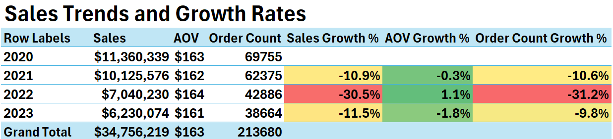

# Tech-Haven-Post-Pandemic-Analysis

# Project Background

Tech Haven, an e-commerce company founded in 2019, specializes in selling popular electronics like Apple, Samsung, and ThinkPad products. I'm partnering with the Head of Operations to extract insights and deliver recommendations to improve performance across sales, product, and marketing teams.

# Executive Summary

Tech Haven's sales analysis of 190k orders across 2020-2024 shows annual revenue significantly dropping since 2020.  Macbook Pro Laptops account for about a quarter of all revenue. Tech Haven can benefit from expanding top product lines, optimizing bundling, and enhancing loyalty programs to increase customer lifetime value. Improvements to the mobile app will strengthen Tech Haven's market position and drive sustainable growth.

# Insights Deep-Dive

**Sales Trends and Growth Rates**

- Tech Haven averages $8.7 million in sales and 53,420 orders each year
- Sales surged in 2020 due to the pandemic, but declined by 38% by 2022
- Tech Haven shows seasonality, with peak sales in December and the lowest sales in February

  

    <strong>Monthly Metrics and Growth Rates Per Year</strong>

  
  
  

  
  
  

**Key Product Performance**

- The Macbook Pro Laptop, with its high AOV of $1,700, drives a large portion of revenue, making it a key focus for Tech Haven’s growth strategy.

- There's a stark contrast between premium products like the Macbook Pro and budget items like AA Batteries, highlighting the need for better product bundling strategies.

- Products like the iPhone and ThinkPad Laptop show strong performance and should be targeted for additional marketing efforts to capture more market share.

- Low-margin accessories like USB-C Charging Cables and Wired Headphones, with high order volumes, present opportunities for repeat purchases and customer loyalty programs.

- The Bose SoundSport Headphone’s high refund rate suggests potential issues with product quality or customer satisfaction, warranting investigation to reduce returns.

**Loyalty Program Performance**

- Loyalty program sales saw a significant decline, dropping by 25.94% from 2022 to 2023, highlighting the need for stronger customer retention strategies.

- Despite the loyalty sales drop, nonloyalty sales have maintained a more consistent performance, with a 5% decrease in sales growth in 2023.

- Customers in the loyalty program consistently spend more, with an average order value (AOV) consistently higher than nonloyalty customers, indicating stronger purchase behavior.

- While AOV growth for loyalty customers remained positive in 2021 and 2022, it declined by 4.24% in 2023, suggesting possible challenges in increasing customer spending.

- Both loyalty and nonloyalty segments experienced order count declines in 2023, with nonloyalty seeing a steeper drop of 35.23%, emphasizing the need for a strategic focus on both segments to maintain order volume.

  

    <strong>Monthly Metrics and Growth Rates Per Year</strong>

  
  
  

**Purchase Platform**

- The mobile app accounts for only 4.98% of total sales, indicating a need for improvements to attract more customers to this platform.

- With the website generating 95.02% of total sales, efforts should focus on enhancing the mobile app to capture a larger share of the market and diversify revenue streams.

  

**Refund Rate Trends**

- Loyalty members show a clear trend of lower refund rates compared to non-loyalty customers, indicating that membership in the program correlates with better product satisfaction or improved purchase confidence.

- Over the years, refund rates have steadily declined for both loyalty and non-loyalty customers, with loyalty members leading the improvement. This suggests that Tech Haven's strategies for customer retention and satisfaction may be effectively reducing dissatisfaction over time.

- The significant reduction in refund counts for loyalty members—falling from 1,182 in 2020 to just 279 in 2023—points to the success of the loyalty program in fostering customer trust and potentially better-targeted product offerings.

- With each passing year, the gap between loyalty and non-loyalty refund rates widens, reinforcing the idea that investing in customer loyalty programs not only strengthens customer retention but also encourages more thoughtful purchasing behavior, reducing returns.

  

